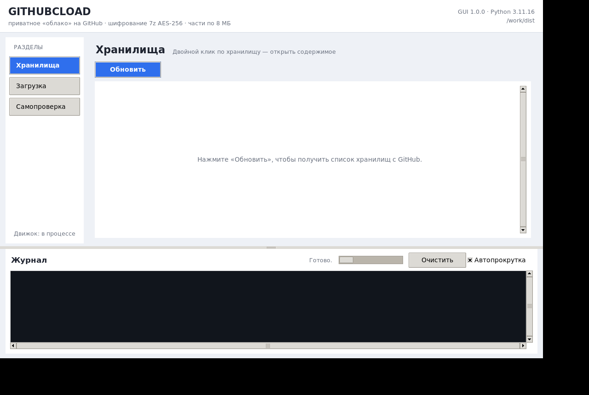
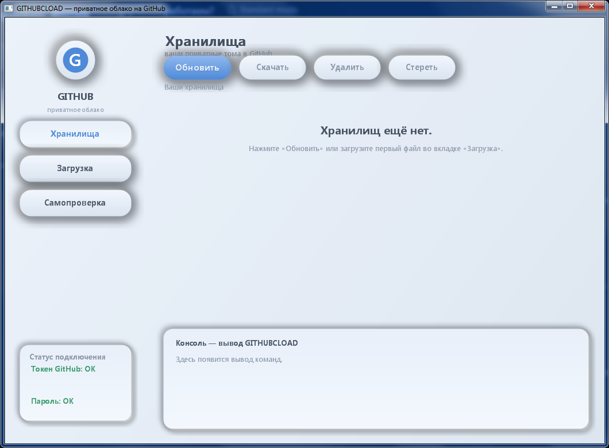

# GITHUBCLOAD

Приватное «облачное» хранилище поверх GitHub. Один скрипт на Python: файлы и папки
**шифруются (7z, AES-256)**, архив **режется на части по 8 МБ** (GitHub API надёжно
принимает один файл до ~8 МБ) и заливается в **приватные репозитории GitHub**
с помощью вашего токена.

---

## Скачать готовые сборки

Страница релизов: <https://github.com/larin-ilya/GHcload/releases>

| Пакет | Что внутри | Что нужно на машине |
|---|---|---|
| `GITHUBCLOAD_v1.1.0_windows_x86.zip` | `GITHUBCLOAD_GUI.exe` — GUI + движок в одном файле | ничего; только ваши `tokengh.txt` и `PBEpass.txt` рядом |
| `GITHUBCLOAD_GUI-linux-x64` | единый Linux-бинарник — GUI + движок | `chmod +x GITHUBCLOAD_GUI-linux-x64`; Python/tkinter вшиты |
| `GITHUBCLOAD_v1.1.0_python.zip` | движок + tkinter-GUI + requirements | Python 3.8+, `pip install -r requirements.txt` (для GUI ещё `python3-tk`) |

Все версии собираются из исходников этого репозитория — инструкции ниже.

---
## Структура репозитория

```
GHcload/
├── GITHUBCLOAD.py            — движок: шифрование, нарезка, загрузка (чистый Python)
├── GITHUBCLOAD_GUI.py        — кроссплатформенный GUI на tkinter (Linux-first)
├── GCB_GUI.cpp               — исходник нативного Windows-GUI (Win32 + GDI+, неоморфизм)
├── core_res.rc               — ресурсы Windows-GUI (вшивание движка, иконка)
├── app.ico                   — иконка приложения
├── build_gui.bat             — сборка Windows-GUI (MinGW)
├── build_single.bat          — сборка единого GITHUBCLOAD_GUI.exe (PyInstaller + MinGW)
├── build_gui_linux.sh        — сборка единого dist/GITHUBCLOAD_GUI (PyInstaller)
├── build_linux_docker.sh     — воспроизводимая сборка Linux-версии в Docker
├── run_gui_linux.sh          — запуск Linux-GUI из исходников (создаёт venv)
├── requirements.txt          — зависимости движка (py7zr, PyGithub)
├── screenshots/              — скриншоты интерфейса (Windows и Linux)
├── CHANGELOG.md
└── README.md
```

> ⚠️ Файлы `tokengh.txt` и `PBEpass.txt` **никогда не попадают в репозиторий** —
> скрипт исключает их при загрузке любой папки, даже вложенной. Оба файла должны
> лежать **в одной папке с** `GITHUBCLOAD_GUI.exe`.

---

## Запуск без установки Python (единым файлом)

Скачайте из [Releases](https://github.com/larin-ilya/GHcload/releases) архив `GITHUBCLOAD_v1.1.0_windows_x86.zip` и распакуйте exe в одну папку с вашими двумя файлами:

1. `GITHUBCLOAD_GUI.exe` — GUI и движок в одном exe (Python и библиотеки внутри);
2. `tokengh.txt` — ваш токен GitHub;
3. `PBEpass.txt` — ваш пароль шифрования.

На машине **не нужны** Python и `pip install`. При запуске GUI извлекает встроенный
движок во временную папку и исполняет команды, а токен и пароль ищет рядом с собой.

---

## Linux / macOS

Движок `GITHUBCLOAD.py` — **чистый Python** (стандартная библиотека + `py7zr` +
`PyGithub`), поэтому на Linux и macOS работает вся командная часть — шифрование 7z,
разрезка на 8 МБ части, загрузка/скачивание. Работает на любой системе с **Python 3.8+**.

Доступен и **графический интерфейс** (`GITHUBCLOAD_GUI.py`, tkinter): те же разделы,
что и в Windows-версии — «Хранилища», «Загрузка», «Самопроверка» + общий журнал.
Подробности — в разделе [«Графический интерфейс в Linux»](#графический-интерфейс-в-linux).
Нативный неоморфный `GITHUBCLOAD_GUI.exe` (Win32 + GDI+) по-прежнему только для
Windows, но архивы полностью совместимы: загруженное на Windows можно скачать
на Linux и наоборот.

### 1. Установка зависимостей

```bash
python3 -m pip install -r requirements.txt
```

Если `pip` нет — поставьте:

```bash
sudo apt update && sudo apt install -y python3 python3-pip
# для сборки py7zr могут понадобиться компилятор и Python-dev
sudo apt install -y build-essential python3-dev
```

### 2. Файлы токена и пароля

В одной папке с `GITHUBCLOAD.py` должны лежать:

* `tokengh.txt` — токен GitHub первой строкой (`repo` scope; для `wipe` нужен ещё `delete_repo`);
* `PBEpass.txt` — пароль шифрования.

**Права на чтение должны быть только у вас** (файлы содержат секрет):

```bash
chmod 600 tokengh.txt PBEpass.txt
```

### 3. Команды (Linux)

```bash
# список всех хранилищ
python3 GITHUBCLOAD.py list
python3 GITHUBCLOAD.py -

# загрузить файл/папку в хранилище photos
python3 GITHUBCLOAD.py upload /путь/к/фото.jpg photos

# содержимое конкретного хранилища
python3 GITHUBCLOAD.py list photos

# скачать хранилище целиком в папку Восстановление
python3 GITHUBCLOAD.py download photos /путь/к/Восстановление

# скачать только элемент по id
python3 GITHUBCLOAD.py download photos /путь/к/Восстановление 20250101_123456_ab12cd

# удалить элемент (id из list)
python3 GITHUBCLOAD.py delete photos 20250101_123456_ab12cd

# стереть всё хранилище (удаляет сами репозитории; нужен scope delete_repo)
python3 GITHUBCLOAD.py wipe photos

# самопроверка без GitHub
python3 GITHUBCLOAD.py selftest
```

Отличий в логике от Windows-версии нет: тот же формат архивов `имя.7z.001…`,
те же имена репозиториев-томов, та же защита от загрузки `tokengh.txt`/`PBEpass.txt`.

---

## Графический интерфейс в Linux

`GITHUBCLOAD_GUI.py` — кроссплатформенный GUI на **tkinter** (только стандартная
библиотека Python, Linux-first). Возможности повторяют Windows-версию:

* **Хранилища** — кнопка «Обновить» выводит список хранилищ; **двойной клик по
  хранилищу** открывает его содержимое: элементы с чекбоксами, кнопка «Скачать»
  на строке, «Скачать выбранные», «Скачать всё», «Удалить» (по id), «Стереть»
  (wipe, с подтверждением) и «← Хранилища»;
* **Загрузка** — «Выбрать файл»/«Выбрать папку», имя хранилища, кнопка
  «Загрузить в облако»;
* **Самопроверка** — прогон selftest движка без GitHub;
* внизу — общий **журнал**: вывод команд движка построчно и в реальном времени,
  кнопка «Очистить», автопрокрутка, код возврата каждой операции.



Движок `GITHUBCLOAD.py` вызывается **в рабочем потоке** (окно не замерзает),
кнопки на время операции блокируются. Сам движок GUI не изменяет.

### Запуск из исходников

Нужны `python3`, `python3-venv` и **`python3-tk`** (в Debian/Ubuntu tkinter не
ставится вместе с python3 автоматически):

```bash
sudo apt install -y python3 python3-venv python3-tk tk
bash run_gui_linux.sh        # сам создаст venv (.venv-linux) и поставит py7zr/PyGithub
```

или вручную:

```bash
python3 -m venv .venv-linux
.venv-linux/bin/pip install -r requirements.txt
.venv-linux/bin/python GITHUBCLOAD_GUI.py
```

Без дисплея (сервер): `xvfb-run -a python3 GITHUBCLOAD_GUI.py --smoke` — служебная
headless-проверка (строит окно и все страницы, код 0).

### Сборка одного самодостаточного файла

Локально (нужен `python3-tk`):

```bash
bash build_gui_linux.sh      # -> dist/GITHUBCLOAD_GUI (PyInstaller --onefile, GUI-режим)
```

Или воспроизводимо в Docker (внутри `python:3.11-slim-bookworm` ставятся `tk`,
`binutils`, `xvfb`, затем запускается `build_gui_linux.sh`; папка проекта
монтируется в `/work`, результат — в `dist/`):

```bash
bash build_linux_docker.sh
```

Собранный файл **не требует Python на машине**:

```bash
./dist/GITHUBCLOAD_GUI
xvfb-run -a dist/GITHUBCLOAD_GUI --smoke     # headless-проверка артефакта
```

### Где должны лежать токен и пароль

GUI ищет `tokengh.txt` и `PBEpass.txt` в «папке приложения» — по тем же правилам,
что и движок (переменная `GCB_APP_DIR`, затем папка исполняемого файла):

* при запуске из исходников — в папке с `GITHUBCLOAD_GUI.py` / `GITHUBCLOAD.py`;
* у собранного `dist/GITHUBCLOAD_GUI` — **рядом с самим бинарником**:

```bash
cp tokengh.txt PBEpass.txt dist/
chmod 600 dist/tokengh.txt dist/PBEpass.txt
./dist/GITHUBCLOAD_GUI
```

В сборку эти файлы не входят; на странице «Самопроверка» есть блок «Диагностика»,
который показывает папку приложения и найден ли каждый из файлов (GUI не читает
их содержимое — его читает только движок).

### Совместимость с Windows

Форматы полностью совпадают: те же репозитории-тома (`имя`, `имя_2`, …), тот же
манифест `_gcb_manifest.json`, те же 7z-архивы AES-256 с частями по 8 МБ.
Хранилище, загруженное Windows-версией (`GITHUBCLOAD_GUI.exe` или CLI), Linux-GUI
открывает без конвертаций, и наоборот — достаточно одинакового `PBEpass.txt`.

Служебные флаги GUI: `--version` (версия и код 0), `--smoke` (headless-проверка,
код 0), `--help`.

---

## Графический интерфейс Windows (нативный, неоморфизм)

> Для Linux и macOS смотрите раздел [«Графический интерфейс в Linux»](#графический-интерфейс-в-linux) —
> кроссплатформенный GUI на tkinter (`GITHUBCLOAD_GUI.py`) с тем же набором возможностей.

`GITHUBCLOAD_GUI.exe` — нативный (без внешних библиотек) интерфейс в стиле
**неоморфизм**: мягкие тени, выпуклые кнопки, аккуратные поля ввода и карточки.
Он просто запускает те же команды, что и в разделе «Команды», и показывает вывод
в нижней «консоли».



* **Хранилища** — кнопка «Обновить» выводит список ваших хранилищ. **Двойной клик
  по хранилищу** открывает его: внутри — список файлов с отметками. Клик по строке
  отмечает файл, кнопка «Скачать» на строке качает именно его, «Скачать выбранные»
  качает все отмеченные разом, «← Хранилища» возвращает назад. На уровне списка
  доступны «Удалить» (по id элемента) и «Стереть» (wipe).
* **Загрузка** — указываете файл/папку (кнопки «Выбрать файл»/«Выбрать папку») и имя
  хранилища, жмёте «Загрузить в облако».
* **Самопроверка** — прогон selftest без GitHub.

> Советы по запуску: единый `GITHUBCLOAD_GUI.exe` (сборка через `build_single.bat`)
> содержит движок внутри и работает без Python. В режиме разработки GUI использует
> лежащий рядом `GITHUBCLOAD_core.exe` либо `python` / `py -3` / `python3` с
> установленными `py7zr` и `github`.

Сборка единого файла (нужны MinGW `C:\PORTABLE\mingw32` и Python с PyInstaller):

```bat
build_single.bat
```

Сборка только GUI (для разработки, движок не вшит):

```bat
build_gui.bat
```

или вручную:

```bat
C:\PORTABLE\mingw32\bin\g++.exe GCB_GUI.cpp -o GITHUBCLOAD_GUI.exe -mwindows -O2 -std=c++17 -static -finput-charset=UTF-8 -fwide-exec-charset=UTF-16LE -lgdiplus -lgdi32 -luser32 -lcomctl32 -lole32 -luuid -lshlwapi -lshell32 -ladvapi32
```

---

## Установка

Нужен Python 3.8+:

```bat
python -m pip install -r requirements.txt
```

### 1. Токен GitHub → `tokengh.txt`

GitHub → Settings → Developer settings → **Personal access tokens** → Generate new token
(классический `Fine-grained tokens` тоже подойдёт).

Права (scopes):

| Scope        | Зачем                                |
|--------------|--------------------------------------|
| `repo`       | создавать приватные репозитории и файлы |
| `delete_repo`| команда `wipe` (необязательно)        |

Вставьте токен **первой строкой** в `tokengh.txt`. Строки, начинающиеся с `#`, — комментарии.

### 2. Пароль шифрования → `PBEpass.txt`

Придумайте надёжный пароль и впишите его в `PBEpass.txt`.
**Этот же пароль потребуется при скачивании** — без него данные не расшифровать.

---

## Команды

### Загрузить (файл или папку)

```bat
python GITHUBCLOAD.py upload C:\Фото\отпуск.jpg photos
python GITHUBCLOAD.py C:\Фото\отпуск.jpg photos        " сокращённая форма
python GITHUBCLOAD.py upload D:\Документы\2024 docs
```

* если архив больше 8 МБ — режется на части по 8 МБ (GitHub Contents API не
  принимает одним запросом больше ~8 МБ — проверено);
* репозиторий создаётся **приватным** автоматически;
* структура папок и **оригинальные имена** сохраняются в архиве.

### Показать всё (все файлы и имена репозиториев)

```bat
python GITHUBCLOAD.py -
python GITHUBCLOAD.py list
```

### Показать конкретное хранилище (оригинальные имена)

```bat
python GITHUBCLOAD.py list photos
python GITHUBCLOAD.py repos
```

### Скачать с расшифровкой

```bat
python GITHUBCLOAD.py download photos C:\Восстановление
python GITHUBCLOAD.py download photos C:\Восстановление 20250101_123456_ab12cd    " один элемент по id
python GITHUBCLOAD.py download photos C:\Восстановление <id1> <id2> <id3>          " несколько элементов
```

* расшифровка происходит «под капотом» (пароль из `PBEpass.txt`);
* куда скачивать — указываете вторым аргументом;
* на диске появляются файлы/папки с **оригинальными именами**.

### Удалить

```bat
python GITHUBCLOAD.py delete photos 20250101_123456_ab12cd    " элемент (id из list)
python GITHUBCLOAD.py wipe photos                             " всё хранилище (репозитории)
```

### Самопроверка (без GitHub)

```bat
python GITHUBCLOAD.py selftest
```

---

## Как это устроено «под капотом»

```
Исходный файл/папка
      │
      ▼
 [py7zr]  архив .7z, пароль из PBEpass.txt
      │     шифрование 7zAES = AES-256 + SHA-256, заголовки тоже шифруются
      ▼
 если размер > 8 МБ → [multivolumefile] части по 8 МБ  (имя.7z.001, .002, …)
      │
      ▼
 [PyGithub] загрузка в приватный репозиторий-том
```

**Том = один репозиторий GitHub.** Имя первого тома — имя хранилища
(`photos`), следующих — `photos_2`, `photos_3` и т.д.

Лимит тома рассчитан так, чтобы фактический размер репозитория **не превышал 1 ГБ**
(полезная нагрузка тома ограничена ~900 МБ — остаток оставляем под служебные данные Git).
При заполнении тома следующий элемент автоматически уходит в новый том `имя_2`, `имя_3`, …
Никаких действий с вашей стороны.

Внутри каждого репозитория-тома:

```
photos/
├── _gcb_manifest.json        ← служебный манифест (список элементов, объём)
└── gcb/
    └── <id_элемента>/
        ├── <id>.7z           ← маленький элемент (1 файл)
        └── <id>.7z.001 …     ← большой элемент, разрезан на 8 МБ части
```

`tokengh.txt` и `PBEpass.txt` в GitHub **не загружаются** в принципе:
при обходе папки скрипт пропускает эти имена в любом вложении, а при прямой
загрузке такого файла — отказывается.

---

## Частые вопросы / ограничения

| Ситуация | Поведение |
|---|---|
| Репозиторий с таким именем уже есть и он не пустой | ошибка: скрипт не трогает чужие данные |
| Один элемент больше ~900 МБ | ошибка: разбейте на части по ~800 МБ и загрузите отдельно |
| Файл/архив больше 8 МБ | автоматически режется на 8 МБ части (GitHub Contents API не берёт одним запросом больше ~8 МБ) |
| Пароль не тот при скачивании | понятная ошибка; проверьте `PBEpass.txt` |
| Удалить всё хранилище | `wipe` — удаляет сами репозитории с GitHub (нужен scope `delete_repo`) |

Совет: не используйте один аккаунт GitHub одновременно для нескольких «облаков» —
хранилище с именем `docs` и том `docs_2` должны принадлежать только ему.
